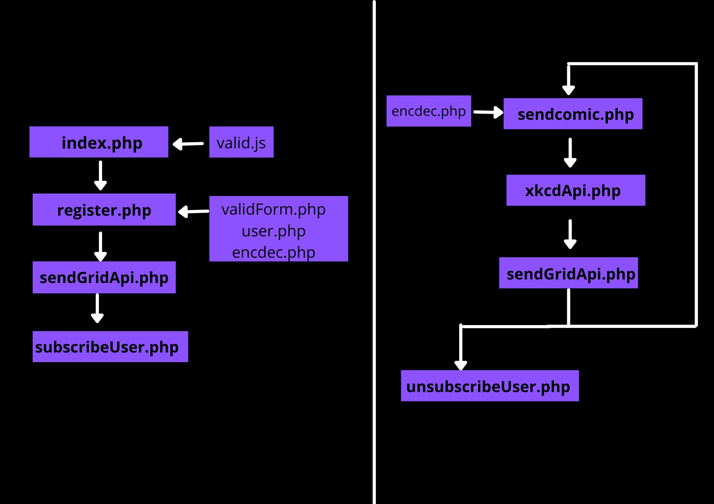

# Email a random XKCD challenge (with tests)

### Project link: http://xkcdmailer.herokuapp.com/

It's a simple PHP application that accepts visitor's email addresses and quickly sends a verification mail to the user.The user can verify himself by clicking on the link provided in that email.
Once the user is verified this web app sends a random XKCD webcomic to the provided email id every 5 minutes.
The comic is sent as an email attachment as well as inline image content.
Users can unsubscribe from these recurring emails at any point of time. Unsubscribe link is sent with the comic e-mail itself.

## Features

- Unique activation code for each user
- Activation code encrypted with AES-128bit
- Basic prevention against XSS(cross-site scripting) vulnerabilities
- Basic prevention against SQL injection vulnerabilities
- User verification through email
- Unsubscribe link with webcomic itself
- Checked against various test cases
- Mobile friendly

## Assumptions

#### I have assumed that I am supposed to send a webcomic after the 5 minutes of verification. (For the first user)

#### I have also assumed that I am supposed to send emails in a batch. (i.e. If a new user comes in between 5 minutes when the script is in sleep mode that user may receive his/her first email before 5 minutes)

## Tech Stack

**Client:** HTML, CSS, Javascript

**Server:** PHP

**API:** <a href="https://sendgrid.com/solutions/email-api/">Sendgrid</a>, <a href="https://xkcd.com/">XKCD</a>

**Database:** <a href="https://remotemysql.com/">remote my sql</a>

**Hosting platform:** <a href="https://www.heroku.com/">Heroku</a>

**Heroku-buildpack:** <a href="https://github.com/timanovsky/subdir-heroku-buildpack">subdir-heroku-buildpack</a> (for hosting a subfolder on heroku)

**CORS:** <a href="https://cors-anywhere.herokuapp.com/corsdemo">cors-anywhere</a>

## Work-flow



## Environment Variables

To run this project, you will need to add the following environment variables to your .env file or as config variables in your hosting service

`DB_DATABASE` `HTTP_HOST (optional)`

`DB_PASSWORD` `PROJECT_PATH (optional)`

`DB_SERVER` `sendgrid_apikey`

`DB_USERNAME` `SERVER_PORT (optional)`

## Run Locally

Clone the project

Go to the project directory

```bash
  cd my-project
```

Install dependencies

```bash
  composer install
```

## Running Tests

To run tests, run the following command

```bash
  .\vendor\bin\phpunit
```

## Limitations

Talking about the limitations of this project here I have taken the help of Heroku procfile's worker functionality to execute "sendcomic.php" recursively. Which in turn takes the help of ''sleep'' to delay the execution for 5 minutes. Sleep has its limitations & it's not as efficient as add-ons like Heroku scheduler.
